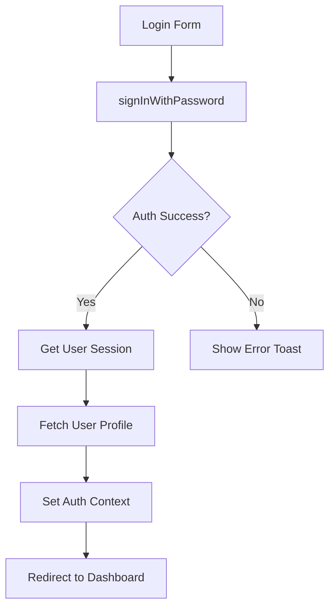

# Техническая архитектура backup-crm

## 1. Архитектурные решения

### 1.1 State Management Strategy

#### Server State: TanStack Query
```typescript
// Пример: src/hooks/useUserProfiles.ts
export function useUserProfiles() {
  return useQuery({
    queryKey: ["user_profiles"],
    queryFn: async () => {
      const { data, error } = await supabase
        .from("user_profiles")
        .select("*")
        .order("created_at", { ascending: false });
      
      if (error) throw error;
      return data as UserProfile[];
    },
  });
}
```

**Преимущества:**
- Автоматический кэш и инвалидация
- Оптимистичные обновления
- Background refetching
- Loading/error states из коробки

#### Client State: React useState + Context
```typescript
// Пример: src/context/AuthContext.tsx
const [user, setUser] = useState<User | null>(null);
const [profile, setProfile] = useState<UserProfile | null>(null);
const [isLoading, setIsLoading] = useState(true);
```

**Использование Context только для:**
- Глобальная аутентификация (AuthContext)
- Настройки темы
- Глобальные UI состояния

### 1.2 Data Fetching Pattern

**Все API запросы через Supabase клиент:**
```typescript
// src/integrations/supabase/client.ts
export const supabase = createClient<Database>(
  SUPABASE_URL, 
  SUPABASE_PUBLISHABLE_KEY,
  {
    auth: {
      storage: localStorage,
      persistSession: true,
      autoRefreshToken: true,
    },
  }
);
```

**Паттерн использования:**
1. Импорт клиента: `import { supabase } from "@/integrations/supabase/client"`
2. Обёртка в TanStack Query hook
3. Обработка ошибок через toast notifications

### 1.3 Component Architecture

#### Atomic Design принципы:
```
components/
├── ui/              # Atoms (Button, Input, Select)
├── [domain]/        # Molecules (StudentCard, GroupForm)
└── layout/          # Organisms (Navbar, Sidebar, PageHeader)

pages/               # Templates & Pages
```

#### Композиция компонентов:
```typescript
// Пример: src/pages/Users.tsx
export default function Users() {
  const { data: profiles } = useUserProfiles();
  
  return (
    <>
      <PageHeader title="Користувачі" />
      <UserTable profiles={profiles} />
      <CreateUserDialog />
    </>
  );
}
```

### 1.4 Type Safety

**Типы генерируются из Supabase schema:**
```typescript
// src/integrations/supabase/types.ts (автогенерация)
export type Database = {
  public: {
    Tables: {
      user_profiles: {
        Row: {
          id: string;
          full_name: string | null;
          role: Database["public"]["Enums"]["user_role"];
          // ...
        };
      };
    };
  };
};
```

**Использование:**
```typescript
import type { Database } from "@/integrations/supabase/types";

export type UserProfile = Database["public"]["Tables"]["user_profiles"]["Row"];
export type UserRole = Database["public"]["Enums"]["user_role"];
```

---

## 2. Паттерны кода

### 2.1 Custom Hooks Pattern

**Структура:**
```typescript
// src/hooks/use[Entity].ts

// READ операция
export function use[Entities]() {
  return useQuery({
    queryKey: ["key"],
    queryFn: async () => { /* fetch logic */ },
  });
}

// CREATE/UPDATE/DELETE операции
export function useCreate[Entity]() {
  const queryClient = useQueryClient();
  
  return useMutation({
    mutationFn: async (data) => { /* mutation logic */ },
    onSuccess: () => {
      queryClient.invalidateQueries({ queryKey: ["key"] });
      toast({ title: "Success" });
    },
    onError: (error) => {
      toast({ title: "Error", description: error.message });
    },
  });
}
```

**Примеры:**
- `useUserProfiles`, `useCreateUser`, `useUpdateUserProfile`
- `useStudents`, `useCreateStudent`, `useUpdateStudent`
- `useGroups`, `useCreateGroup`, `useDeleteGroup`

### 2.2 Form Handling Pattern

**React Hook Form + Zod:**
```typescript
// 1. Определить schema
const schema = z.object({
  email: z.string().email("Невірний email"),
  password: z.string().min(6, "Мінімум 6 символів"),
});

type FormData = z.infer<typeof schema>;

// 2. Создать форму
const form = useForm<FormData>({
  resolver: zodResolver(schema),
  defaultValues: { email: "", password: "" },
});

// 3. Submit handler
const onSubmit = async (data: FormData) => {
  await mutation.mutateAsync(data);
};

// 4. JSX
<form onSubmit={form.handleSubmit(onSubmit)}>
  <Input {...form.register("email")} />
  {form.formState.errors.email && <span>{form.formState.errors.email.message}</span>}
</form>
```

### 2.3 Dialog/Modal Pattern

**Управление состоянием:**
```typescript
const [isOpen, setIsOpen] = useState(false);

<Dialog open={isOpen} onOpenChange={setIsOpen}>
  <DialogTrigger asChild>
    <Button>Відкрити</Button>
  </DialogTrigger>
  <DialogContent>
    <DialogHeader>
      <DialogTitle>Заголовок</DialogTitle>
    </DialogHeader>
    {/* Form or content */}
    <DialogFooter>
      <Button onClick={() => setIsOpen(false)}>Закрити</Button>
    </DialogFooter>
  </DialogContent>
</Dialog>
```

**Закрытие после успеха:**
```typescript
const mutation = useMutation({
  mutationFn: async (data) => { /* logic */ },
  onSuccess: () => {
    setIsOpen(false); // закрываем диалог
    form.reset();     // сбрасываем форму
  },
});
```

### 2.4 Table Pattern

**Структура:**
```typescript
<Table>
  <TableHeader>
    <TableRow>
      <TableHead>Колонка 1</TableHead>
      <TableHead>Колонка 2</TableHead>
    </TableRow>
  </TableHeader>
  <TableBody>
    {data.map((item) => (
      <TableRow key={item.id}>
        <TableCell>{item.field1}</TableCell>
        <TableCell>{item.field2}</TableCell>
      </TableRow>
    ))}
  </TableBody>
</Table>
```

**С загрузкой:**
```typescript
if (isLoading) return <div>Завантаження...</div>;
if (error) return <div>Помилка: {error.message}</div>;
if (!data?.length) return <div>Немає даних</div>;

return <Table>...</Table>;
```

### 2.5 Error Handling Pattern

**Toast notifications:**
```typescript
import { toast } from "@/hooks/use-toast";

// Success
toast({ 
  title: "Успіх", 
  description: "Дані збережено" 
});

// Error
toast({ 
  title: "Помилка", 
  description: error.message,
  variant: "destructive" 
});
```

**Try-catch в async функциях:**
```typescript
try {
  const { data, error } = await supabase.from("table").select();
  if (error) throw error;
  return data;
} catch (error: any) {
  toast({ 
    title: "Помилка", 
    description: error.message,
    variant: "destructive" 
  });
  throw error;
}
```

---

## 3. Supabase Integration

### 3.1 Row Level Security (RLS)

**Все таблицы защищены RLS политиками:**

```sql
-- Пример: user_profiles
-- Policy: Users can read their own profile
CREATE POLICY "Users can read own profile"
  ON user_profiles
  FOR SELECT
  USING (auth.uid() = id);

-- Policy: Admins can read all profiles
CREATE POLICY "Admins can read all profiles"
  ON user_profiles
  FOR SELECT
  USING (
    EXISTS (
      SELECT 1 FROM user_profiles
      WHERE id = auth.uid()
      AND role IN ('owner', 'admin')
    )
  );
```

### 3.2 Database Triggers

**Автоматическое создание профиля при регистрации:**
```sql
CREATE TRIGGER create_user_profile_on_signup
  AFTER INSERT ON auth.users
  FOR EACH ROW
  EXECUTE FUNCTION create_user_profile();
```

### 3.3 Database Functions

**Примеры:**
- `distribute_payment()` - распределение платежей
- `recalculate_balances()` - пересчёт балансов
- `calculate_staff_salary()` - расчёт зарплаты

**Вызов из TypeScript:**
```typescript
const { data, error } = await supabase.rpc('function_name', {
  param1: value1,
  param2: value2,
});
```

### 3.4 Real-time Subscriptions

**Пример подписки:**
```typescript
useEffect(() => {
  const channel = supabase
    .channel('table_changes')
    .on(
      'postgres_changes',
      { 
        event: '*', 
        schema: 'public', 
        table: 'user_profiles' 
      },
      (payload) => {
        console.log('Change received!', payload);
        queryClient.invalidateQueries({ queryKey: ['user_profiles'] });
      }
    )
    .subscribe();

  return () => {
    supabase.removeChannel(channel);
  };
}, []);
```

---

## 4. Authentication Flow

### 4.1 Логин процесс



**Код:**
```typescript
// src/context/AuthContext.tsx
const signInWithPassword = async (email: string, password: string) => {
  setIsLoading(true);
  try {
    const { data, error } = await supabase.auth.signInWithPassword({
      email,
      password,
    });
    
    if (error) throw error;
    
    // Profile fetch происходит автоматически через onAuthStateChange
  } catch (error: any) {
    toast({
      title: "Помилка входу",
      description: error.message,
      variant: "destructive",
    });
    throw error;
  } finally {
    setIsLoading(false);
  }
};
```

### 4.2 Session Management

**Автоматическое восстановление сессии:**
```typescript
useEffect(() => {
  const {
    data: { subscription },
  } = supabase.auth.onAuthStateChange(async (event, session) => {
    if (session?.user) {
      setUser(session.user);
      setSession(session);
      
      // Fetch profile
      const { data } = await supabase
        .from("user_profiles")
        .select("*")
        .eq("id", session.user.id)
        .single();
      
      setProfile(data);
      setRole(data?.role ?? null);
    } else {
      setUser(null);
      setSession(null);
      setProfile(null);
      setRole(null);
    }
    setIsLoading(false);
  });

  return () => subscription.unsubscribe();
}, []);
```

### 4.3 Protected Routes

**Route guard паттерн:**
```typescript
// src/main.tsx или router config
if (!session && !isPublicRoute) {
  return <Navigate to="/login" />;
}

if (session && isPublicRoute) {
  return <Navigate to="/" />;
}

if (profile?.role === "parent") {
  return <Navigate to="/parent-portal" />;
}
```

---

## 5. Performance Optimizations

### 5.1 TanStack Query Caching

**Стратегии:**
```typescript
// Кэш на 5 минут
useQuery({
  queryKey: ["data"],
  queryFn: fetchData,
  staleTime: 5 * 60 * 1000,
});

// Background refetch при focus
useQuery({
  queryKey: ["data"],
  queryFn: fetchData,
  refetchOnWindowFocus: true,
});

// Optimistic updates
useMutation({
  mutationFn: updateData,
  onMutate: async (newData) => {
    // Оптимистично обновляем кэш
    await queryClient.cancelQueries({ queryKey: ["data"] });
    const previous = queryClient.getQueryData(["data"]);
    queryClient.setQueryData(["data"], newData);
    return { previous };
  },
  onError: (err, newData, context) => {
    // Откатываем при ошибке
    queryClient.setQueryData(["data"], context?.previous);
  },
});
```

### 5.2 React Performance

**Мемоизация:**
```typescript
// useMemo для тяжёлых вычислений
const filteredData = useMemo(() => {
  return data.filter(item => item.active);
}, [data]);

// useCallback для стабильных функций
const handleClick = useCallback(() => {
  doSomething();
}, [dependency]);
```

**React.memo для компонентов:**
```typescript
const ExpensiveComponent = React.memo(({ data }) => {
  return <div>{/* render */}</div>;
});
```

### 5.3 Lazy Loading

**Code splitting:**
```typescript
const Dashboard = lazy(() => import("./pages/Dashboard"));
const Users = lazy(() => import("./pages/Users"));

<Suspense fallback={<LoadingSpinner />}>
  <Routes>
    <Route path="/" element={<Dashboard />} />
    <Route path="/users" element={<Users />} />
  </Routes>
</Suspense>
```

---

## 6. Testing Strategy (будущее)

### 6.1 Unit Tests
- Jest + Testing Library
- Тесты хуков и утилит

### 6.2 Component Tests
- Testing Library
- Snapshot тесты UI компонентов

### 6.3 E2E Tests
- Playwright или Cypress
- Критические user flows

---

## 7. Best Practices

### 7.1 TypeScript
✅ **Делать:**
- Использовать strict mode
- Типизировать все функции
- Избегать `any` (использовать `unknown`)
- Генерировать типы из Supabase

❌ **Не делать:**
- Type assertions без необходимости
- Игнорирование ошибок TS

### 7.2 React
✅ **Делать:**
- Разбивать большие компоненты
- Использовать custom hooks для логики
- Мемоизировать где нужно
- Обрабатывать loading/error states

❌ **Не делать:**
- Inline style (использовать Tailwind)
- Логику в JSX
- Прямые mutации state

### 7.3 Supabase
✅ **Делать:**
- Использовать RLS политики
- Валидировать на клиенте и сервере
- Обрабатывать ошибки БД

❌ **Не делать:**
- Хранить чувствительные данные в клиенте
- Обходить RLS через service role key на клиенте

### 7.4 Git
✅ **Делать:**
- Atomic commits
- Понятные commit messages
- Pull перед push

❌ **Не делать:**
- Коммитить credentials
- Огромные коммиты

---

## 8. Architecture Diagram

```
┌─────────────────────────────────────────────────────┐
│                   Frontend (Vite)                    │
│                                                       │
│  ┌──────────────┐  ┌──────────────┐  ┌────────────┐ │
│  │    Pages     │  │  Components  │  │   Hooks    │ │
│  │              │  │              │  │            │ │
│  │ - Users      │  │ - UI (btn,   │  │ - useUser  │ │
│  │ - Students   │  │   input...)  │  │ - useAuth  │ │
│  │ - Groups     │  │ - Students   │  │ - use...   │ │
│  │ - ...        │  │ - Staff      │  │            │ │
│  └──────────────┘  └──────────────┘  └────────────┘ │
│                                                       │
│  ┌──────────────┐  ┌──────────────┐                 │
│  │   Context    │  │  TanStack    │                 │
│  │              │  │   Query      │                 │
│  │ - AuthCtx    │  │              │                 │
│  └──────────────┘  └──────────────┘                 │
│                         │                            │
│                         ▼                            │
│              ┌──────────────────┐                    │
│              │ Supabase Client  │                    │
│              └──────────────────┘                    │
└────────────────────┼───────────────────────────────┘
                     │
                     ▼
         ┌───────────────────────┐
         │   Supabase (Backend)  │
         │                       │
         │  ┌─────────────────┐  │
         │  │   PostgreSQL    │  │
         │  │   - Tables      │  │
         │  │   - Functions   │  │
         │  │   - Triggers    │  │
         │  │   - RLS         │  │
         │  └─────────────────┘  │
         │                       │
         │  ┌─────────────────┐  │
         │  │   Auth System   │  │
         │  │   - JWT         │  │
         │  │   - Sessions    │  │
         │  └─────────────────┘  │
         │                       │
         │  ┌─────────────────┐  │
         │  │ Edge Functions  │  │
         │  │ (optional)      │  │
         │  └─────────────────┘  │
         └───────────────────────┘
```

---

**Дата:** 8 февраля 2026  
**Версия:** 1.0
